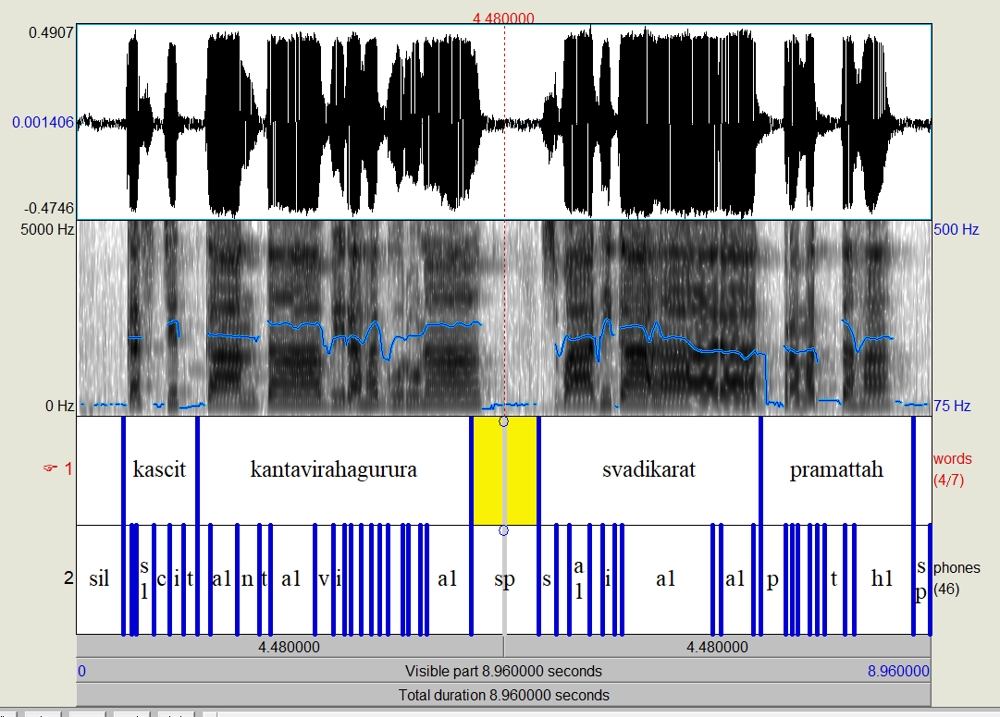

# mfa_experiments
Experiments using Montreal Forced Aligner with Sanskrit Audio

Currently, there is a simple set of scripts to run the MFA aligner on a set of manually annotated shlokas from मेघदूतम्

## Use the generated results
1. Download and split the audio, along with creating some extra files for the Montreal Forced Aligner
  ```
  pip install -r requirements.txt`
  cd meghaduta
  python create_mfa_files.py
  ```
2. Download [Praat](https://www.fon.hum.uva.nl/praat/)
3. Run Praat. Use Open -> Read from File (Ctrl+O) to load the textgrid file from the [output dir](meghaduta/output/) and the corresponding audio from the generated [train dir](meghaduta/train/). Select both files and Click "View & Edit". The syllable level-alignment will be shown as in the screenshot below. Click on any text segment, and use `Tab` key to play the audio. For more information, see Praat Help.


More details regarding the alignment output can be found in the [MFA docs](https://montreal-forced-aligner.readthedocs.io/en/latest/user_guide/formats/corpus_structure.html?highlight=textgrid#textgrid-format)

## Recreate results

1. Install Montreal Forced Aligner following the [instructions](https://montreal-forced-aligner.readthedocs.io/en/latest/installation.html). (I used the Windows Subsystem for Linux approach on my Windows desktop, with miniconda)
2. Run:
```
pip install -r requirements.txt
cd meghaduta
python create_mfa_files.py
mfa train -o ./acoustic_model -t ./temp ./train dict.txt ./output
mfa align -t temp train/ dict.txt acoustic_model.zip output/
```
(Some recent versions of MFA leave the textgrids in `temp/train_pretrained_aligner/pretrained_aligner/textgrids/`. You may need to `cp` them into `output`)

This will generate the acoustic model and the alignments in the `output` dir in the TextGrid format. See instructions above for using this output.

## Speech to text
To use the generated acoustic model to train a language model and use it for Speech to text, run the following commands. Note that the accuracy will be very low, since we trained on only 65 shlokas.
```
cd meghaduta
mfa train_lm train meghaduta_lm
mfa transcribe test dict.txt ./acoustic_model.zip ./meghaduta_lm.zip test_output
```